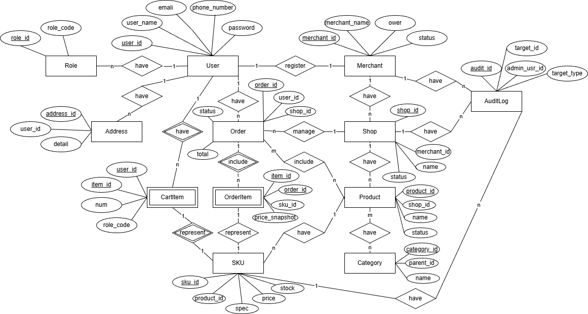

# TheMall 系统概要设计文档

## 0. 状态码系统设计

### 0.1 状态码统一规范

系统采用统一的状态码设计，所有实体（用户、商家、店铺、商品、订单）都遵循相同的状态码规范。

#### 0.1.1 用户状态（UserStatus）

| 状态码 | 常量名 | 说明 | 业务影响 |
|--------|--------|------|----------|
| 1 | ACTIVE | 正常 | 用户可以正常登录、创建订单、下单等所有操作 |
| 0 | DISABLED | 禁用 | 用户无法登录、无法创建订单、无法下单等所有操作 |

**验证点**：
- 登录时验证用户状态
- 创建订单时验证用户状态
- 支付订单时验证用户状态
- 添加购物车时验证用户状态

#### 0.1.2 商家状态（MerchantStatus）

| 状态码 | 常量名 | 说明 | 业务影响 |
|--------|--------|------|----------|
| 1 | ACTIVE | 正常 | 商家可以正常管理店铺、商品、订单等所有操作 |
| 0 | DISABLED | 禁用 | 商家无法管理店铺、无法管理商品、无法管理订单等所有操作 |

**验证点**：
- 创建店铺时验证商家状态
- 管理店铺时验证商家状态
- 创建商品时验证商家状态
- 管理商品时验证商家状态
- 查看订单时验证商家状态

#### 0.1.3 店铺状态（ShopStatus）

| 状态码 | 常量名 | 说明 | 业务影响 |
|--------|--------|------|----------|
| 1 | ACTIVE | 正常营业 | 店铺正常营业，商品可见，可以下单 |
| 2 | CLOSED | 商家关闭 | 商家主动关闭，商品全部下架，无法下单，商家可以重新开启 |
| 3 | ADMIN_CLOSED | 管理员强制关闭 | 管理员强制关闭，商品全部下架，无法下单，商家无法重新开启，需要管理员操作 |

**验证点**：
- 查看店铺时验证店铺状态（只有ACTIVE状态可见）
- 查看商品时验证店铺状态（只有ACTIVE店铺的商品可见）
- 添加购物车时验证店铺状态
- 创建订单时验证店铺状态
- 店铺被关闭时，自动下架所有商品

**状态转换规则**：
- 商家可以：ACTIVE ↔ CLOSED（商家可以关闭和重新开启自己的店铺）
- 管理员可以：ACTIVE ↔ CLOSED，ACTIVE → ADMIN_CLOSED，ADMIN_CLOSED → ACTIVE
- 商家无法将 ADMIN_CLOSED 状态的店铺恢复为 ACTIVE（需要管理员操作）

#### 0.1.4 商品状态（ProductStatus）

| 状态码 | 常量名 | 说明 | 业务影响 |
|--------|--------|------|----------|
| 1 | ON_SHELF | 上架 | 商品正常在售，用户可以购买 |
| 2 | OFF_SHELF | 下架 | 商家主动下架，用户无法购买，商家可以重新上架 |
| 3 | ADMIN_OFF_SHELF | 管理员下架 | 管理员强制下架，用户无法购买，商家无法重新上架，需要管理员操作 |

**验证点**：
- 查看商品时验证商品状态（只有ON_SHELF状态可见）
- 添加购物车时验证商品状态
- 创建订单时验证商品状态
- 商家上架商品时验证商品状态（ADMIN_OFF_SHELF状态无法上架）

**状态转换规则**：
- 商家可以：ON_SHELF ↔ OFF_SHELF
- 管理员可以：ON_SHELF → ADMIN_OFF_SHELF，ADMIN_OFF_SHELF → ON_SHELF
- 店铺被禁用时：所有商品自动变为 OFF_SHELF

#### 0.1.5 订单状态（OrderStatus）

| 状态码 | 常量名 | 说明 | 业务影响 |
|--------|--------|------|----------|
| 0 | WAIT_PAY | 待支付 | 订单已创建，等待用户支付 |
| 1 | PAID | 已支付 | 订单已支付，等待商家发货 |
| 2 | SHIPPED | 已发货 | 商家已发货，等待用户确认收货 |
| 3 | COMPLETED | 已完成 | 订单已完成 |
| 4 | CANCELLED | 已取消 | 订单已取消，库存已恢复，购物车已恢复 |
| 5 | REFUNDING | 退款中 | 订单退款中 |
| 6 | REFUNDED | 已退款 | 订单已退款 |

**状态转换规则**：
- 用户取消：WAIT_PAY → CANCELLED（恢复库存和购物车）
- 用户支付：WAIT_PAY → PAID
- 商家发货：PAID → SHIPPED
- 用户确认收货：SHIPPED → COMPLETED
- 自动确认收货：SHIPPED（24小时后）→ COMPLETED

### 0.2 状态验证规则

#### 0.2.1 用户操作验证

1. **登录验证**：用户状态必须为 ACTIVE
2. **创建订单验证**：用户状态必须为 ACTIVE
3. **支付订单验证**：用户状态必须为 ACTIVE
4. **添加购物车验证**：用户状态必须为 ACTIVE

#### 0.2.2 商家操作验证

1. **创建店铺验证**：商家状态必须为 ACTIVE
2. **管理店铺验证**：商家状态必须为 ACTIVE
3. **创建商品验证**：商家状态必须为 ACTIVE，店铺状态必须为 ACTIVE
4. **管理商品验证**：商家状态必须为 ACTIVE，店铺状态必须为 ACTIVE
5. **查看订单验证**：商家状态必须为 ACTIVE

#### 0.2.3 店铺访问验证

1. **查看店铺验证**：店铺状态必须为 ACTIVE（普通用户和管理员）
2. **查看商品验证**：店铺状态必须为 ACTIVE，商品状态必须为 ON_SHELF（普通用户）
3. **添加购物车验证**：店铺状态必须为 ACTIVE，商品状态必须为 ON_SHELF
4. **创建订单验证**：店铺状态必须为 ACTIVE，商品状态必须为 ON_SHELF

#### 0.2.4 商品状态联动

1. **店铺被禁用**：店铺状态变为 SUSPENDED 或 CLOSED 时，所有商品自动变为 OFF_SHELF
2. **店铺恢复**：店铺状态恢复为 ACTIVE 时，商品状态不变（需要商家手动上架）

## 1. 系统模块划分

### 1.1 模块划分原则

1. **按业务领域划分**：每个模块对应一个业务领域，职责单一
2. **高内聚低耦合**：模块内部功能紧密相关，模块间依赖最小化
3. **可扩展性**：为未来功能扩展预留空间
4. **符合DDD（领域驱动设计）**：按业务边界划分模块

### 1.2 模块结构设计

采用**多模块Maven项目**结构，父项目统一管理依赖版本，子模块独立实现业务功能。

```
hgmall 
├── hgmall-common -- 工具类及通用代码 
├── hgmall-mbg -- MyBatisGenerator生成的数据库操作代码 
├── hgmall-security -- SpringSecurity封装公用模块 
├── hgmall-admin -- 后台商城管理系统接口 
├── hgmall-search -- 基于Elasticsearch的商品搜索系统 
├── hgmall-portal -- 前台商城系统接口 
└── hgmall-demo -- 框架搭建时的测试代码
└── hgmall-web --前端vite代码

```


数据库设计



### 数据表清单
14张表

- **role**: role_id, role_code
- **user**: user_id, user_name, email, phone_number, password, role_id
- **address**: address_id, user_id, detail
- **merchant**: merchant_id, merchant_name, owner, status, user_id
- **shop**: shop_id, merchant_id, name, status
- **product**: product_id, shop_id, name, status
- **sku**: sku_id, product_id, spec, price, stock
- **category**: category_id, parent_id, name
- **product_category**: product_id, category_id
- **cart_item**: user_id, item_id, sku_id, num, role_code
- **batch_order**: batch_order_id, user_id, total_amount, status, address_id, create_time, pay_time, expire_time
- **order**: order_id, batch_order_id, user_id, shop_id, status, total, address_id
- **order_item**: order_id, item_id, sku_id, price_snapshot
- **audit_log**: audit_id, admin_usr_id, target_id, target_type

### 数据库索引设计（PostgreSQL）

**说明**：
- 所有表的主键会自动创建唯一索引
- 索引命名规范：`idx_{表名}_{字段名}`，复合索引使用下划线连接字段名
- 外键字段建议建立索引以提升JOIN查询性能
- 时间字段用于排序查询时建议使用DESC索引

#### 1. role 表
```sql
-- 主键索引（自动创建）
PRIMARY KEY (role_id)
-- 业务查询索引
CREATE UNIQUE INDEX idx_role_code ON role(role_code);
```

#### 2. user 表
```sql
-- 主键索引（自动创建）
PRIMARY KEY (user_id)
-- 登录查询索引
CREATE UNIQUE INDEX idx_user_name ON user(user_name);
CREATE UNIQUE INDEX idx_user_email ON user(email);
CREATE INDEX idx_user_phone ON user(phone_number);
CREATE INDEX idx_user_role ON user(role_id);
```

#### 3. address 表
```sql
-- 主键索引（自动创建）
PRIMARY KEY (address_id)
-- 用户地址查询
CREATE INDEX idx_address_user ON address(user_id);
```

#### 4. merchant 表
```sql
-- 主键索引（自动创建）
PRIMARY KEY (merchant_id)
-- 业务查询索引
CREATE INDEX idx_merchant_user ON merchant(user_id);
CREATE INDEX idx_merchant_status ON merchant(status);
-- 复合索引
CREATE INDEX idx_merchant_user_status ON merchant(user_id, status);
```

#### 5. shop 表
```sql
-- 主键索引（自动创建）
PRIMARY KEY (shop_id)
-- 商家店铺查询
CREATE INDEX idx_shop_merchant ON shop(merchant_id);
CREATE INDEX idx_shop_status ON shop(status);
-- 复合索引
CREATE INDEX idx_shop_merchant_status ON shop(merchant_id, status);
```

#### 6. product 表
```sql
-- 主键索引（自动创建）
PRIMARY KEY (product_id)
-- 店铺商品查询
CREATE INDEX idx_product_shop ON product(shop_id);
CREATE INDEX idx_product_status ON product(status);
-- 复合索引（商品列表查询）
CREATE INDEX idx_product_shop_status ON product(shop_id, status);
-- 全文搜索索引（商品名称，需要先配置中文分词）
CREATE INDEX idx_product_name_gin ON product USING gin(to_tsvector('simple', name));
```

#### 7. sku 表
```sql
-- 主键索引（自动创建）
PRIMARY KEY (sku_id)
-- 商品SKU查询
CREATE INDEX idx_sku_product ON sku(product_id);
-- 价格范围查询
CREATE INDEX idx_sku_price ON sku(price);
-- 库存查询
CREATE INDEX idx_sku_stock ON sku(stock);
-- 复合索引（商品详情页SKU列表）
CREATE INDEX idx_sku_product_stock ON sku(product_id, stock) WHERE stock > 0;
```

#### 8. category 表
```sql
-- 主键索引（自动创建）
PRIMARY KEY (category_id)
-- 树形结构查询
CREATE INDEX idx_category_parent ON category(parent_id);
-- 分类名称查询
CREATE INDEX idx_category_name ON category(name);
```

#### 9. product_category 表
```sql
-- 复合主键索引（自动创建）
PRIMARY KEY (product_id, category_id)
-- 反向查询索引
CREATE INDEX idx_pc_category ON product_category(category_id);
```

#### 10. cart_item 表
```sql
-- 复合主键索引（自动创建）
PRIMARY KEY (user_id, item_id)
-- 购物车查询（用户所有购物车项）
CREATE INDEX idx_cart_user ON cart_item(user_id);
-- SKU查询
CREATE INDEX idx_cart_sku ON cart_item(sku_id);
```

#### 11. order 表
```sql
-- 主键索引（自动创建）
PRIMARY KEY (order_id)
-- 注意：order为PostgreSQL保留字，建表时需使用双引号或改名
-- 用户订单查询
CREATE INDEX idx_order_user ON "order"(user_id);
-- 店铺订单查询
CREATE INDEX idx_order_shop ON "order"(shop_id);
-- 订单状态查询
CREATE INDEX idx_order_status ON "order"(status);
-- 时间范围查询（订单列表，需添加create_time字段）
CREATE INDEX idx_order_create_time ON "order"(create_time DESC);
-- 复合索引（用户订单列表，需添加create_time字段）
CREATE INDEX idx_order_user_status_time ON "order"(user_id, status, create_time DESC);
-- 复合索引（店铺订单列表，需添加create_time字段）
CREATE INDEX idx_order_shop_status_time ON "order"(shop_id, status, create_time DESC);
```

#### 12. order_item 表
```sql
-- 复合主键索引（自动创建）
PRIMARY KEY (order_id, item_id)
-- 订单项查询
CREATE INDEX idx_order_item_order ON order_item(order_id);
-- SKU销售统计
CREATE INDEX idx_order_item_sku ON order_item(sku_id);
```

#### 13. audit_log 表
```sql
-- 主键索引（自动创建）
PRIMARY KEY (audit_id)
-- 目标对象查询
CREATE INDEX idx_audit_target ON audit_log(target_type, target_id);
-- 管理员操作查询
CREATE INDEX idx_audit_admin ON audit_log(admin_usr_id);
-- 时间范围查询（需添加create_time字段）
CREATE INDEX idx_audit_time ON audit_log(create_time DESC);
-- 复合索引（需添加create_time字段）
CREATE INDEX idx_audit_target_time ON audit_log(target_type, target_id, create_time DESC);
```

### Redis 缓存设计

#### 缓存策略原则
1. **热点数据缓存**：频繁访问的只读或低频更新数据
2. **查询结果缓存**：复杂查询结果缓存
3. **分布式锁**：保证并发安全
4. **缓存失效**：设置合理的TTL，数据更新时主动失效

#### 缓存Key设计规范
```
{业务模块}:{实体类型}:{标识}:{字段}
```

#### 具体缓存方案

##### 1. 用户相关缓存
```
# 用户信息缓存（登录后缓存，更新时失效）
user:info:{user_id} -> Hash
  TTL: 30分钟
  字段: user_id, user_name, email, phone_number, role_id

# 用户登录Token
user:token:{token} -> user_id
  TTL: 7天

# 用户权限缓存
user:roles:{user_id} -> Set[role_code]
  TTL: 30分钟
```

##### 2. 商品相关缓存
```
# 首页整页缓存
home:page -> JSON
  TTL: 30-120秒
  内容: 各一级分类最新16个商品 + 全站Top3销量商品

# 商品详情缓存
product:detail:{product_id} -> JSON
  TTL: 1小时
  内容: 商品详情 + SKU列表

# 分类商品列表缓存（分页）
product:list:{category}:page={page}:size={size} -> JSON
  TTL: 30-60秒
  内容: 商品列表 + 分页信息

# 商品销量排行榜（ZSet）
product:sales:rank -> ZSet
  score: 销量(sales)
  member: product_id
  下单成功时同步更新

# 店铺商品列表缓存（分页）
shop:products:{shop_id}:page:{page}:size:{size} -> List[product_id]
  TTL: 10分钟

```

##### 3. 购物车缓存
```
# 用户购物车（使用Hash存储，便于部分更新）
cart:user:{user_id} -> Hash
  key: sku_id
  value: JSON{num, role_code, add_time}
  TTL: 7天（用户登录时刷新）
  
# 购物车商品总数（快速显示）
cart:count:{user_id} -> Integer
  TTL: 7天
```

##### 4. 订单相关缓存
```
# 订单详情缓存
order:detail:{order_id} -> Hash
  TTL: 30分钟

# 用户订单列表缓存（分页）
user:orders:{user_id}:status:{status}:page:{page} -> List[order_id]
  TTL: 5分钟

# 店铺订单列表缓存
shop:orders:{shop_id}:status:{status}:page:{page} -> List[order_id]
  TTL: 5分钟
```

##### 5. 分类树缓存
```
# 分类树缓存（全量缓存，更新时失效）
category:tree -> JSON
  TTL: 1小时

# 分类详情缓存
category:detail:{category_id} -> Hash
  TTL: 1小时
```

##### 6. 商家店铺缓存
```
# 店铺详情缓存
shop:detail:{shop_id} -> Hash
  TTL: 30分钟

# 商家店铺列表缓存
merchant:shops:{merchant_id} -> List[shop_id]
  TTL: 30分钟
```

##### 7. 分布式锁
```
# 库存扣减锁
lock:sku:stock:{sku_id} -> lock_value
  TTL: 10秒（自动释放）

# 订单创建锁（防止重复提交）
lock:order:create:{user_id} -> lock_value
  TTL: 5秒

# 购物车操作锁
lock:cart:{user_id} -> lock_value
  TTL: 3秒
```

##### 8. 计数器缓存
```
# 商品浏览量
product:view:{product_id} -> Integer
  使用INCR命令，定期同步到数据库
  TTL: 永久（或定期清理）

# 商品销量统计
product:sales:{product_id} -> Integer
  TTL: 永久（定期同步）
```

#### 缓存更新策略

1. **Cache Aside（旁路缓存）**
   - 读取：先查缓存，未命中查数据库并写入缓存
   - 更新：更新数据库，删除缓存

2. **Write Through（写穿透）**
   - 购物车等高频写操作：同时更新缓存和数据库

3. **延迟双删**
   - 更新数据库 -> 删除缓存 -> 延迟再删除一次（防止并发问题）

4. **缓存预热**
   - 系统启动时预热：分类树、热门商品、角色权限等

5. **缓存降级**
   - 缓存失效时，使用本地缓存或直接查询数据库

#### 索引与缓存设计总结

**索引设计原则**：
- 主键和外键字段自动建索引
- 频繁WHERE条件的字段建立单列索引
- 多字段组合查询建立复合索引（字段顺序：等值查询 -> 范围查询 -> 排序字段）
- 部分索引：如`WHERE stock > 0`减少索引大小
- 全文搜索使用GIN索引

**缓存设计原则**：
- **热数据优先**：用户信息、商品详情、购物车等高频访问数据
- **TTL策略**：根据数据更新频率设置（库存5秒，订单列表5分钟，分类树1小时）
- **写操作密集场景**：使用Write Through策略（购物车）
- **读多写少场景**：使用Cache Aside策略（商品详情、分类树）
- **并发控制**：使用Redis分布式锁防止数据不一致

**性能优化建议**：
1. 订单表、审计日志表建议添加`create_time`字段用于时间范围查询
2. 商品搜索使用Elasticsearch，Redis缓存热门搜索结果
3. 大列表查询使用分页缓存，避免缓存整个列表
4. 库存扣减使用Redis原子操作（INCR/DECR）+ 数据库最终一致性

## 3. API接口设计

### 3.1 前台商品接口（hgmall-portal）

#### 1. 首页接口
- **接口路径**: `GET /home`
- **功能**: 获取首页展示数据
- **返回内容**:
  - 每个一级分类下最新创建的16个商品
  - 全站销量Top3商品
- **商品字段**: `product_id`, `name`, `cover_image_url`, `min_sku_price`, `sales`
- **缓存**: `home:page` (TTL: 30-120秒)

#### 2. 分类商品列表接口
- **接口路径**: `GET /products`
- **请求参数**: 
  - `categories`(可选，支持多个分类ID，如：`?categories=1&categories=2` 或 `?categories=1,2,3`)
  - `category`(可选，单个分类ID，向后兼容，如：`?category=1`)
  - `page`(可选，页码，默认1)
  - `size`(可选，每页大小，默认20)
- **支持方式**:
  - 单个分类：`?category=1` 或 `?categories=1`
  - 多个分类：`?categories=1&categories=2` 或 `?categories=1,2,3`
  - 全部商品：不传分类参数
- **排序**: 按 `product.created_at` 倒序

- **缓存**: `product:list:{categories}:page={page}:size={size}` (TTL: 30-60秒)
  - 多个分类时，分类ID会排序去重后拼接（如：`product:list:1,2,3:page=1:size=20`）

#### 3. 商品详情接口
- **接口路径**: `GET /products/{productId}`
- **返回内容**: 商品详情 + SKU列表
- **缓存**: `product:detail:{productId}`

### 3.2 销量统计机制
- **Redis ZSet**: `product:sales:rank` 存储商品销量排行榜
- **更新时机**: 订单成功时同步更新MySQL和Redis
- **Top N查询**: 使用 `ZREVRANGE` 获取销量Top N商品

### 3.3 管理员接口（hgmall-admin）

#### 1. 商家管理接口

##### 1.1 查看商家列表
- **接口路径**: `GET /api/admin/merchants`
- **请求参数**:
  - `status`(可选): 状态筛选（0-禁用，1-正常）
  - `keyword`(可选): 关键词搜索（商家名称、负责人）
  - `page`(可选，默认1): 页码
  - `size`(可选，默认20): 每页大小
- **返回内容**: 商家列表（包含商家信息、关联用户信息、店铺数量等）
- **权限**: 需要管理员身份验证

##### 1.2 查看商家详情
- **接口路径**: `GET /api/admin/merchants/{merchantId}`
- **返回内容**: 商家详细信息（包含关联店铺列表）
- **权限**: 需要管理员身份验证

##### 1.3 审核商家申请
- **接口路径**: `POST /api/admin/merchants/{merchantId}/audit`
- **请求体**:
  ```json
  {
    "action": "approve",  // approve-同意，reject-拒绝
    "reason": "审核通过"  // 可选，审核意见
  }
  ```
- **功能**: 审核商家申请，同意或拒绝
- **权限**: 需要管理员身份验证
- **审计日志**: 记录操作日志

##### 1.4 管理商家状态
- **接口路径**: `POST /api/admin/merchants/{merchantId}/status`
- **请求体**:
  ```json
  {
    "status": 1,  // 1-正常，0-禁用
    "reason": "商家违规"  // 可选，操作原因
  }
  ```
- **功能**: 启用或禁用商家
- **权限**: 需要管理员身份验证
- **审计日志**: 记录操作日志

#### 2. 用户管理接口

##### 2.1 查看用户列表
- **接口路径**: `GET /api/admin/users`
- **请求参数**:
  - `roleId`(可选): 角色ID筛选
  - `status`(可选): 状态筛选（1-正常，0-禁用）
  - `keyword`(可选): 关键词搜索（用户名、邮箱）
  - `page`(可选，默认1): 页码
  - `size`(可选，默认20): 每页大小
- **返回内容**: 用户列表（敏感信息需脱敏处理）
- **权限**: 需要管理员身份验证

##### 2.2 查看用户详情
- **接口路径**: `GET /api/admin/users/{userId}`
- **返回内容**: 用户详细信息（包含商家信息、订单数量等）
- **权限**: 需要管理员身份验证

##### 2.3 管理用户状态
- **接口路径**: `POST /api/admin/users/{userId}/status`
- **请求体**:
  ```json
  {
    "status": 1,  // 1-正常，0-禁用
    "reason": "用户违规"  // 可选，操作原因
  }
  ```
- **功能**: 启用或禁用用户
- **权限**: 需要管理员身份验证
- **审计日志**: 记录操作日志

##### 2.4 查看用户订单历史
- **接口路径**: `GET /api/admin/users/{userId}/orders`
- **请求参数**: `page`, `size`, `status`(可选)
- **返回内容**: 用户订单列表
- **权限**: 需要管理员身份验证

#### 3. 分类管理接口

##### 3.1 创建分类
- **接口路径**: `POST /api/admin/categories`
- **请求体**:
  ```json
  {
    "parentId": 0,  // 0表示一级分类，否则为父分类ID
    "name": "电子产品",
    "sortOrder": 0  // 可选，排序序号
  }
  ```
- **功能**: 创建商品分类
- **权限**: 需要管理员身份验证
- **审计日志**: 记录操作日志

##### 3.2 修改分类
- **接口路径**: `PUT /api/admin/categories/{categoryId}`
- **请求体**:
  ```json
  {
    "name": "电子产品（更新）",
    "sortOrder": 1
  }
  ```
- **功能**: 修改分类信息
- **权限**: 需要管理员身份验证
- **审计日志**: 记录操作日志

##### 3.3 删除分类
- **接口路径**: `DELETE /api/admin/categories/{categoryId}`
- **功能**: 删除分类（需检查是否有商品使用该分类，有子分类需先删除子分类）
- **权限**: 需要管理员身份验证
- **审计日志**: 记录操作日志

##### 3.4 查看分类树
- **接口路径**: `GET /api/admin/categories/tree`
- **返回内容**: 完整的分类树结构（递归结构）
- **权限**: 需要管理员身份验证
- **缓存**: `category:tree` (TTL: 1小时)

#### 4. 订单管理接口

##### 4.1 查看所有订单列表
- **接口路径**: `GET /api/admin/orders`
- **请求参数**:
  - `shopId`(可选): 店铺ID筛选
  - `merchantId`(可选): 商家ID筛选
  - `status`(可选): 订单状态筛选（0-待支付，1-已支付，2-已发货，3-已完成，4-已取消，5-退款中，6-已退款）
  - `startTime`(可选): 开始时间（ISO格式）
  - `endTime`(可选): 结束时间（ISO格式）
  - `keyword`(可选): 关键词搜索（订单ID、用户名）
  - `page`(可选，默认1): 页码
  - `size`(可选，默认20): 每页大小
- **返回内容**: 订单列表（包含订单信息、用户信息、店铺信息、订单项等）
- **权限**: 需要管理员身份验证

##### 4.2 查看订单详情
- **接口路径**: `GET /api/admin/orders/{orderId}`
- **返回内容**: 订单详细信息（包含完整订单项、收货地址等）
- **权限**: 需要管理员身份验证

##### 4.3 取消订单（冻结订单）
- **接口路径**: `POST /api/admin/orders/{orderId}/cancel`
- **请求体**:
  ```json
  {
    "reason": "订单异常，需要人工处理"  // 必填，取消原因
  }
  ```
- **功能**: 取消订单，将订单状态设置为已取消（status=4），恢复商品库存
- **权限**: 需要管理员身份验证
- **审计日志**: 记录操作日志

##### 4.4 查看订单统计
- **接口路径**: `GET /api/admin/orders/statistics`
- **请求参数**: `startTime`, `endTime`, `shopId`(可选), `merchantId`(可选)
- **返回内容**: 订单统计信息（总订单数、总金额、按状态分布、按店铺统计等）
- **权限**: 需要管理员身份验证

#### 5. 审计日志查看接口

##### 5.1 查看审计日志列表
- **接口路径**: `GET /api/admin/audit-logs`
- **请求参数**:
  - `targetType`(可选): 目标对象类型（merchant/shop/product/order/user/category等）
  - `operationType`(可选): 操作类型（create/update/delete/audit/status等）
  - `adminUserId`(可选): 操作人ID
  - `targetId`(可选): 目标对象ID
  - `startTime`(可选): 开始时间
  - `endTime`(可选): 结束时间
  - `page`(可选，默认1): 页码
  - `size`(可选，默认20): 每页大小
- **返回内容**: 审计日志列表（包含操作人、操作时间、操作类型、操作对象、操作描述等）
- **权限**: 需要管理员身份验证

##### 5.2 查看审计日志详情
- **接口路径**: `GET /api/admin/audit-logs/{auditId}`
- **返回内容**: 审计日志详细信息
- **权限**: 需要管理员身份验证

#### 6. 系统配置管理接口

##### 6.1 获取系统配置
- **接口路径**: `GET /api/admin/config`
- **返回内容**: 系统配置信息（商家审核开关、店铺审核开关等）
- **权限**: 需要管理员身份验证
- **存储**: Redis存储，Key格式：`config:{type}:{key}`

##### 6.2 更新商家审核开关
- **接口路径**: `PUT /api/admin/config/merchant-audit`
- **请求体**:
  ```json
  {
    "enabled": true  // true-开启审核，false-不审核
  }
  ```
- **功能**: 设置商家审核开关
- **权限**: 需要管理员身份验证
- **存储**: Redis Key: `config:merchant:audit:enabled`
- **默认值**: false（不审核）

##### 6.3 更新店铺审核开关
- **接口路径**: `PUT /api/admin/config/shop-audit`
- **请求体**:
  ```json
  {
    "enabled": true  // true-开启审核，false-不审核
  }
  ```
- **功能**: 设置店铺审核开关
- **权限**: 需要管理员身份验证
- **存储**: Redis Key: `config:shop:audit:enabled`
- **默认值**: false（不审核）

#### 7. 管理员接口通用设计说明

##### 7.1 权限验证
- 所有管理员接口都需要验证管理员身份
- 从JWT token获取 `userId`
- 验证用户角色为管理员（`role_code = 'ADMIN'`）
- 在Controller层统一验证

##### 7.2 审计日志记录
- 所有修改操作都需要记录审计日志到 `audit_log` 表
- 记录字段：`admin_user_id`, `target_id`, `target_type`, `operation_type`, `operation_desc`, `create_time`
- 操作类型包括：create/update/delete/audit/status等

##### 7.3 数据脱敏
- 用户邮箱、手机号需要脱敏显示（如：`user***@example.com`, `138****5678`）
- 用户名可以部分脱敏

##### 7.4 分页规范
- 默认页码：1
- 默认每页大小：20
- 返回总记录数（total）

##### 7.5 错误处理
- 统一使用 `CommonResult` 返回
- 包含 `code`（200成功，其他失败）、`message`（错误消息）、`data`（返回数据）

##### 7.6 系统配置存储
- 使用Redis存储系统配置
- Key格式：`config:{type}:{key}`
- 例如：`config:merchant:audit:enabled`
- 默认值：false（不审核）

